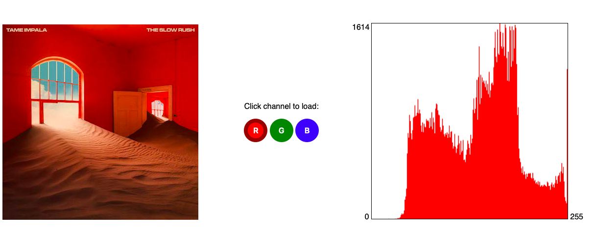

# HTML5 histogram
A simple histogram generator for a single image. Its values are based on RGB channel selected by the user.

The image is the artwork for the music album "THE SLOW RUSH", by Tame Impala. 
I do not own any rights to this image, and it's being used for educational purposes, only.

Screenshot:

